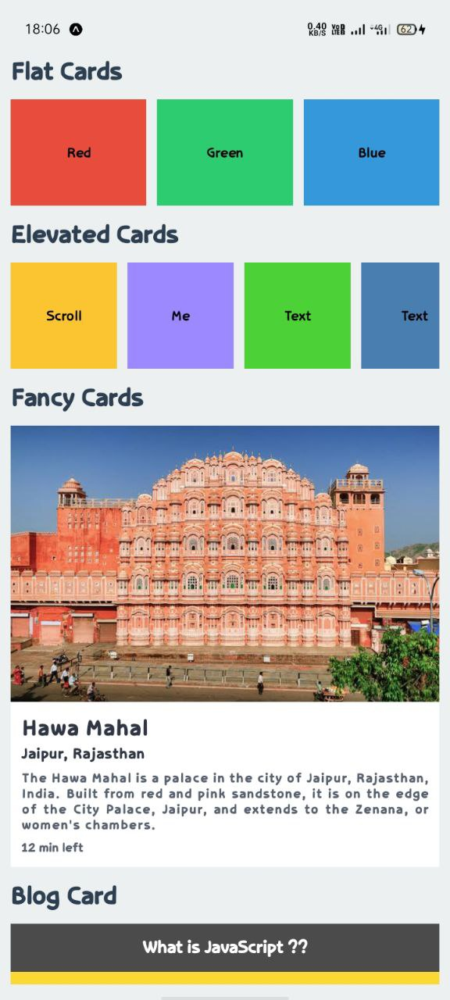

# React Native

## Project 1 - Basic Styled React Native Application

So in this project i learn about react native and the native bundler (metro) also learn basics components like View, Text, StyleSheet, SafeAreaView, ScrollView, Image, TouchableOpacity and many more things.

## Page 1

## Page 2

